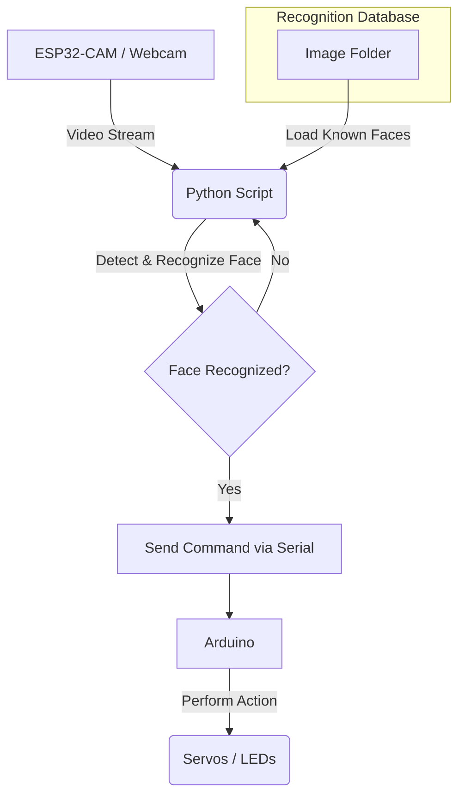

# FaceDetectionESP32

[](https://www.python.org/)
[](https://opencv.org/)
[](https://github.com/ageitgey/face_recognition)

A real-time face detection and recognition system that uses an ESP32-CAM stream or a local webcam. The system can trigger actions, such as controlling servos or LEDs via an Arduino, based on the identity of the person recognized.

## 🌟 Features

*   **Real-time Face Recognition**: Identifies known individuals from a live video stream.
*   **Multiple Video Sources**: Supports both ESP32-CAM IP streams and standard USB webcams.
*   **Arduino Integration**: Sends commands to an Arduino board over serial communication to trigger physical actions.
*   **Flexible and Extensible**: Easily add new faces and define new actions for recognized individuals.

## ⚙️ System Architecture

The system captures video frames, detects faces, and compares them against a database of known faces. When a known face is recognized, a specific command is sent to an Arduino to perform a corresponding action.



## 📂 File Descriptions

Here's an overview of the key files in this repository:

*   `face_detection_ESP32_serial.py`: The main application. It captures video from an ESP32-CAM, performs face recognition, and sends commands to an Arduino via a serial connection to trigger actions.
*   `face_detection_webcam.py`: A version of the application that uses a local webcam as the video source. It's great for testing the face recognition logic without the ESP32-CAM and Arduino setup.
*   `face_detection_ESP32.py`: A simplified version that works with the ESP32-CAM for face recognition but does not include Arduino integration.
*   `LEDSerial.py`: A small utility script to test the serial communication with your Arduino. You can use it to send commands manually and verify that your hardware is responding correctly.

## 🛠️ Setup and Installation

To get the project running, please follow these steps. **Administrator privileges are required for some installation steps.**

### 1. Prerequisites

*   **Python**: Ensure you have Python (3.7 or newer) installed. Add Python to your system's PATH during installation.
*   **CMake**: The `dlib` library (a dependency of `face_recognition`) requires CMake. Download and install it here.
*   **C++ Compiler**: You'll need a C++ compiler. On Windows, you can install the "C++ desktop development" workload with Visual Studio Community.
    1.  Download and install Visual Studio Community.
    2.  In the Visual Studio Installer, modify your installation.
    3.  Under the "Workloads" tab, select **Desktop development with C++** and click "Install".

### 2. Install Python Libraries

Install the required Python packages using `pip`. It is recommended to use a virtual environment.

```bash
pip install -r requirements.txt
```

*(Note: If a `requirements.txt` file is not available, you can install the libraries manually: `pip install opencv-python numpy face_recognition pyserial`)*

### 3. Prepare Known Faces

Place images of the individuals you want to recognize into a folder. Each image file should be named after the person (e.g., `John_Doe.jpg`).

Update the `path` variable in the Python scripts to point to this folder. For example, in `face_detection_ESP32_serial.py`:

```python
# Before
# path = r'C:\Face_Detection\image_folder'

# After
path = r'D:\path\to\your\image_folder'
```

## 🚀 How to Run

### With ESP32-CAM and Arduino

1.  **Configure the script**: Open `face_detection_ESP32_serial.py` and set the `url` to your ESP32-CAM's streaming address and the `port` to your Arduino's COM port.
2.  **Run the script**:
    ```bash
    python face_detection_ESP32_serial.py
    ```

### With a Local Webcam

1.  **Run the script**:
    ```bash
    python face_detection_webcam.py
    ```

Press `q` in the video window to quit the application.